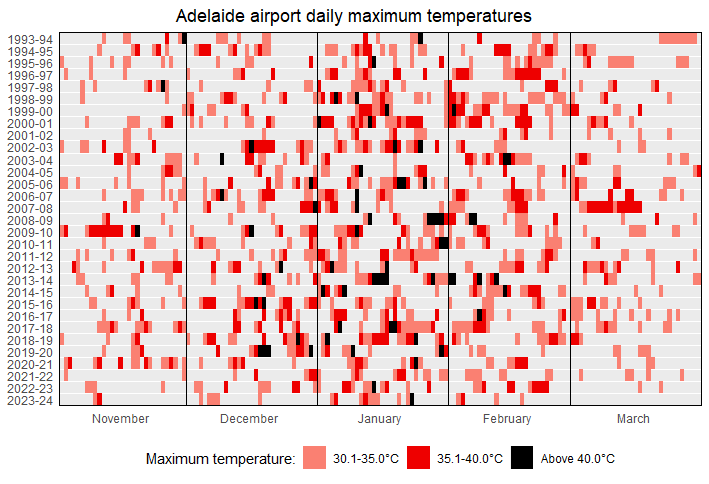
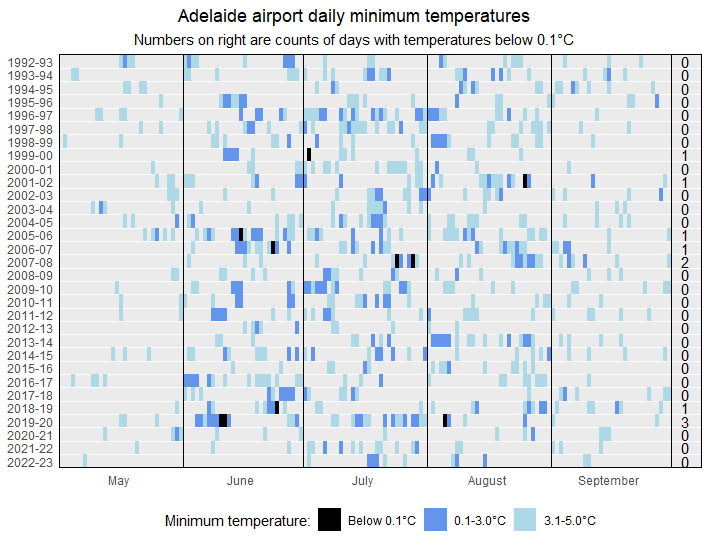

# Adelaide temperatures
Graphs of Adelaide city and airport maximum and minimum temperatures in summer and winter

## Data
The data are from the [Australian Bureau of Meterology](http://www.bom.gov.au/?ref=logo) website. Temperature measurements were downloaded for all years for the following stations:

**Adelaide (West Terrace / Ngayirdapira)** (station number 23000):
* [Daily maximum temperature](http://www.bom.gov.au/jsp/ncc/cdio/weatherData/av?p_nccObsCode=122&p_display_type=dailyDataFile&p_startYear=&p_c=&p_stn_num=023000)
* [Daily minimum temperature](http://www.bom.gov.au/jsp/ncc/cdio/weatherData/av?p_nccObsCode=123&p_display_type=dailyDataFile&p_startYear=&p_c=&p_stn_num=023000)
* Unfortunately, there are no data from 1980 to 2016.

**Adelaide Airport** (station number 23034):
* [Daily maximum temperature](http://www.bom.gov.au/jsp/ncc/cdio/weatherData/av?p_nccObsCode=122&p_display_type=dailyDataFile&p_startYear=&p_c=&p_stn_num=023034)
* [Daily minimum temperature](http://www.bom.gov.au/jsp/ncc/cdio/weatherData/av?p_nccObsCode=123&p_display_type=dailyDataFile&p_startYear=&p_c=&p_stn_num=023034)
* The data extend as far back as 1955.

## Graphs

